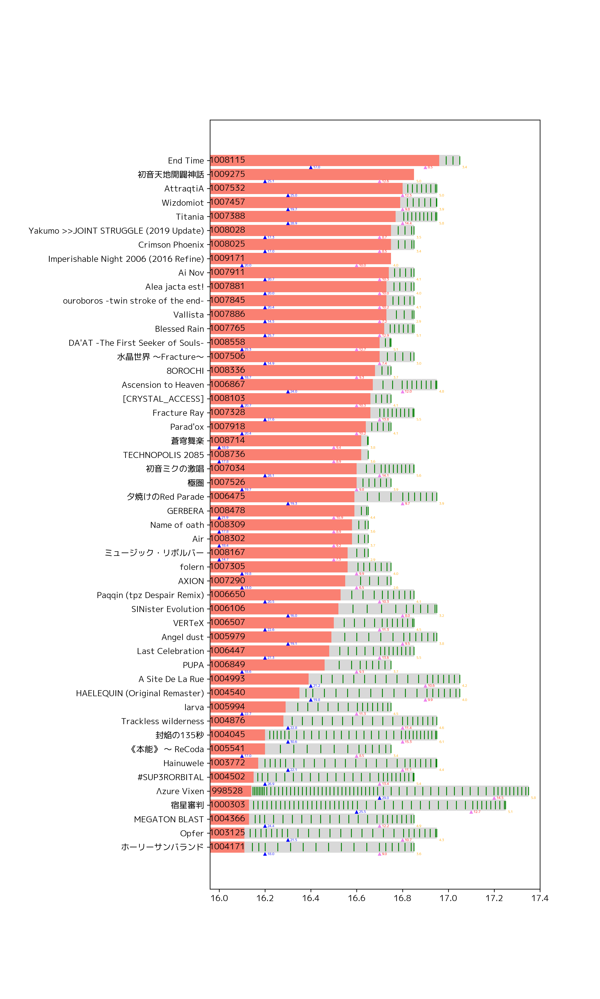

# chunirec.py

[chunirec](https://chunirec.net/)が公開しているAPIを用いてリザルトの解析をします

## 例

デフォルトで動作するプログラム、

```
python3 chunirec.py
```

では、`bests.png`という「ベスト枠とベスト枠候補(SSS)」をグラフに含めた図を生成します。

作者の例



## 注意点

- 依存パッケージ
  - `matplotlib`
  - `requests`
- 日本語を描画するためにフォントを変更しなければいけません。
  - chunirec.pyのデフォルトは`M+ 1p`です。
  - fonts.pyを用いて生成されたfont.pngから使うことのできるフォントを探すことができます。
    - 文字化けしていないフォントに適宜変更してください。
- 環境変数`CHUNIREC_TOKEN`にchunirec APIのtokenを設定してください。
